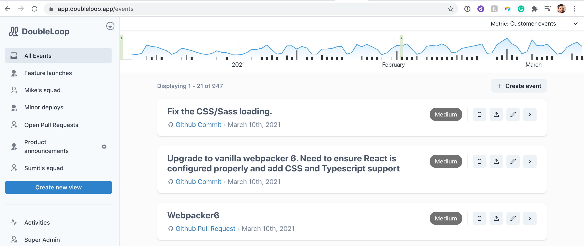

# GitHub integration

## Overview

Most GitHub apps are designed to help engineers get their work done. This one is different. The DoubleLoop GitHub app helps engineering and product leaders stay in the loop with what their team is shipping. With DoubleLoop, you see only the important stuff without having to sift through a bunch of noise.

Combined with DoubleLoop's [Slack integration](../slack-setup.md) and ability to [save filtered "views," ](../filtering-and-saving-views.md)DoubleLoop provides a powerful way to stay up-to-speed with product iterations.

## How to install the GitHub app

1. If you haven't already, [create your DoubleLoop account](https://app.doubleloop.app/sign_up).
2. After you're logged in, navigate to the Integration pages by clicking "Integrations" in the left rail.
3. Click the "Install GitHub app" button and walk through the steps.

**Important notes:**

* If you're concerned about granting access to your GitHub account, please check out our [security page](https://www.doubleloop.app/security) for context.
* While DoubleLoop is most powerful with all of your repositories connected, if you'd like to take a more cautious approach, you can start by connecting just one of your repos.

## Ok, we installed it. Now what?

DoubleLoop doesn't import historical data yet, but after your next pull request or commit, you'll see it appear on the [all events](https://app.doubleloop.app/events) page in DoubleLoop. They'll look like this:

Here are some more details about how it works:

* By default, we set the "importance" of all events to "Medium." The exceptions are commits or PRs created by bots, like Dependabot. Bot events are downgraded automatically to "Minor" to give you a way to filter out the noise of library upgrades, etc.. However, you can use the pencil icon to adjust the importance however you want.
* For each event, click the arrow to expand more information. You can see useful stuff like the list of commits contained in the PR and other details like the repo, branch,  contributors, and summary.
* You can add more info in DoubleLoop by uploading images for events or clicking the pencil icon to add the business context like goals and results.

## The real power

After you have enough data in DoubleLoop, you can start creating some interesting filtered "views" of your GitHub data and connect them to Slack. We can help you set things up! Schedule an onboarding session [here](https://calendly.com/doubleloop/onboarding).

But if you'd like to learn on your own,  see the page [Filtering and saving "views.](../filtering-and-saving-views.md)"

