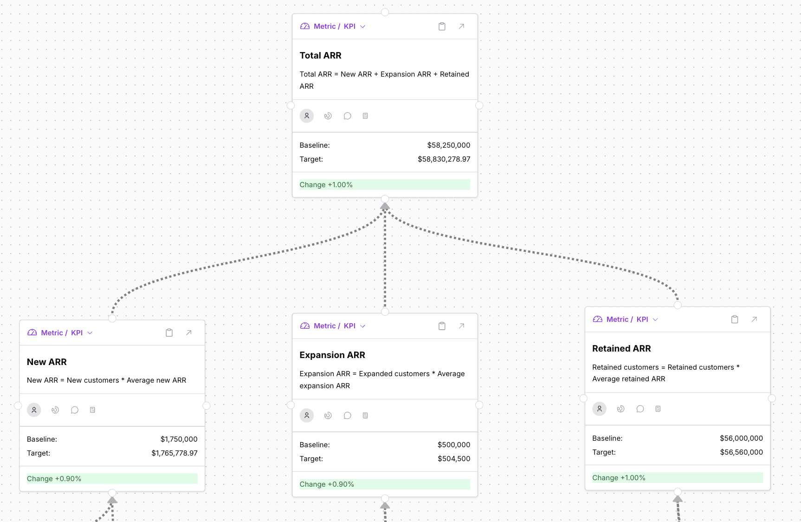

# Build your First Proof-of-Concept

Our approach is designed to help you get large benefits from Value Architecture, fast by using a deterministic KPI tree to run a simulation of bet impact.

1. **Build a deterministic KPI tree for your product/company.** To make this easier, start with one of these templates:
   1. [SaaS template](https://app.doubleloop.app/playbooks/saas-simulator-playbook)
   2. [eCommerce template](https://app.doubleloop.app/playbooks/ecommerce-simulator-playbook)
   3. [Generic template](https://app.doubleloop.app/playbooks/generic-simulator-playbook)
2. **Map a few bets/projects to inputs in your KPI tree**. The playbooks have examples. Replace those examples with real ones.
3. **Run a simulation** with a few colleagues.
   1. Enter simulation mode.
   2. Update your baseline values. It's OK to guess to get start quickly and refine your baselines later.
   3. Adjust your impact percentages.
   4. Click "Run sim"
   5. Compare the impact of your bets.

If you get stuck or would like feedback, reach out!

<figure><figcaption>
Example eCommerce Simulation 
</figcaption></figure>

<figure><figcaption>
Example SaaS Simulation
</figcaption></figure>
