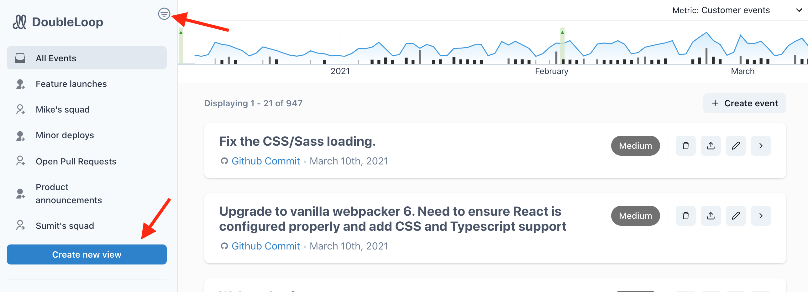
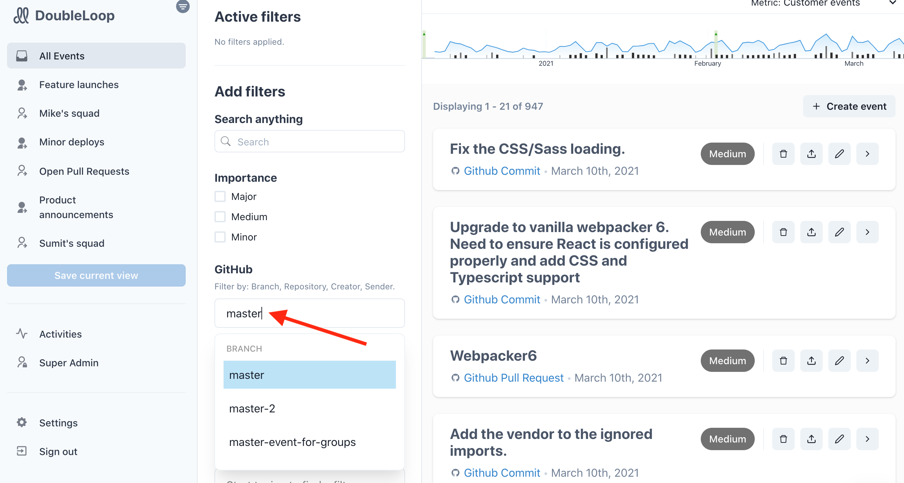
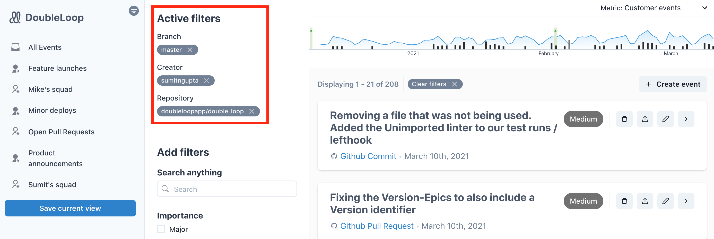

# Filtering and saving "views"

## Overview

Different people care about different things. As a product or engineering leader, for example, you might care less about commits to a feature branch and more about a PR merged to master. Or maybe you want to stay in the loop with what each different product squad is shipping. The "views" feature in DoubleLoop provides you a way to filter for just what you want to see. Combined with our [Jira app](our-jira-app.md), [GitHub app](github-setup-instructions.md), and [Slack integration](slack-setup.md), it's a powerful way to send the right notifications to the right people.

The first step to creating views is filtering.

## Filtering events

To expand the filter options, click the "Create new view" button or filter icon.

After the filter panel is open, you can do a text search or filter by the "importance" of events.

A lot of the power of DoubleLoop comes from setting up integrations. If you've set up our [GitHub integration](github-setup-instructions.md), try typing stuff into the GitHub search box, like "Master."

You can also search by repo or team member. When you've done a search, your active filters will appear at the top of the filter panel.

## Saving views

When you've set a valuable filter or combination of filters, you can save it as a view. Just click the "Save current view" button. After giving it a name and saving it, it will appear in the left rail for future access.

Important: all members of your DoubleLoop organization will see the same list of views. So if you add a new view or delete one, it affects everyone.

## Connecting views Slack channels

This is where things get really interesting! You can use DoubleLoop to design your own system of signal-rich Slack notifications. Learn more on the page about [our Slack integration](slack-setup.md).

## We're happy to help set up your views!

Are you unsure about the best way to set up views for your team? [Schedule an onboarding session](https://calendly.com/doubleloop/onboarding) and we can do it together!

