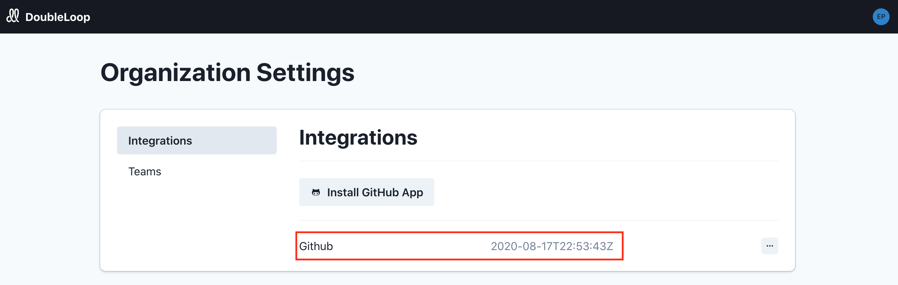

# GitHub app setup

DoubleLoop is still pre-launch and there are some basic features we haven't added yet. But we'd love it if you'd be willing to install our GitHub app. Doing so will help us tune the system to make DoubleLoop a powerful tool for your company.

1. Go here: [https://metaloop.app/](https://metaloop.app/)
2. Now you can create your account. You can either...
   1. Click the "create an account" link, or
   2. Click the button to sign up with GitHub.
3. After creating your account, you'll be asked to name your organization. Enter the name of your company and click "Create organization."
4. Now let's connect your GitHub. Click the gear "Settings" icon in the left nav.
5. Click "Integrations."
6. Now click "Install GitHub App" and walk through the steps. If you're concerned about granting access to GitHub, please check out our [security page](https://www.doubleloop.app/security) for context.
7. When you're done, you won't get a confirmation message. But if you go back to the integrations page, you'll see your GitHub integration like this:

That's it! Now we'll start receiving data that will teach us how to make DoubleLoop awesome for you. We'll be in touch.

