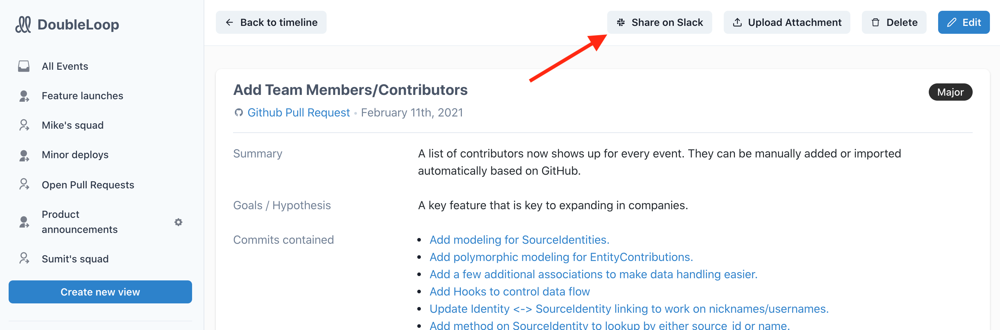
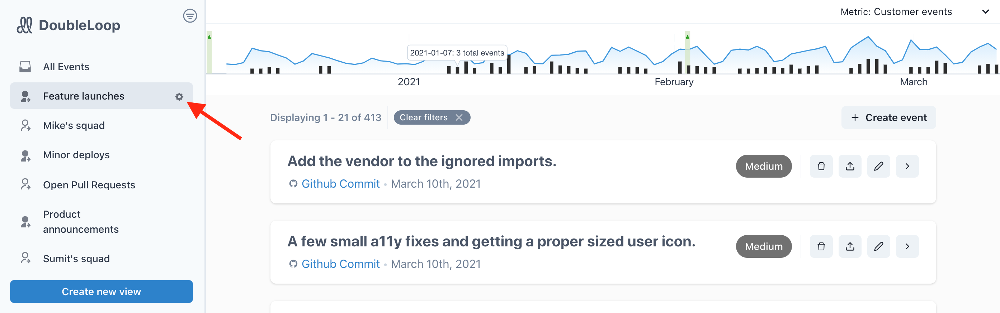

# Slack integration

DoubleLoop enables you to automatically communicate product changes via Slack. For example, you can use DoubleLoop to create real-time deployment notifications, curated launch announcements, and team-specific views. Check out this [demo video ](https://www.loom.com/share/17ad8cad783443e8b76cf680810b08de)to see it in action. 

This page covers how to:

1. ⚙ Integrate DoubleLoop with Slack.
2. 🧤 Manually share DoubleLoop events in Slack.
3. 🤖 Automatically send product updates to Slack based on filtered "views" of your engineering activity.

## ⚙ Integrate DoubleLoop with Slack

1. If you haven't already, [create your DoubleLoop account](https://app.doubleloop.app/sign_up).
2. After you're logged in, navigate to the [integrations page](https://app.doubleloop.app/organizations/settings/integrations) by clicking "Integrations" in the left rail.
3. Click the "Install Slack app" button in the "Learn" section and walk through the steps.

If you're concerned about granting access to your Slack account, please check out our [security page](https://www.doubleloop.app/security).

## 🧤 Manually share DoubleLoop events in Slack

While the unique power of DoubleLoop is to _automatically_ push product updates to slack, you can also manually share events that are worth the attention of your team. And it's a good way to prove that your Slack integration is working.

1. From the [events page](https://metaloop.app/events) in DoubleLoop, click on the title of an event you want to share.
2. Click the "Share on Slack" button.
3. Select the channel or DM you want to send it to.
4. Click "Send to Slack".

A message like this will appear in your selected Slack channel:

## 🤖 Automatically send product updates to Slack

The power of DoubleLoop is unleashed when you design your own system for automatically pushing product updates to Slack based on filtered views of activity. 

Here's how it works:

1. Create filtered views \(see [instructions](filtering-and-saving-views.md)\). For example, you can create a view of just PRs merged to master or for the work of a particular team.
2. Click the gear icon to the right of the view to open a modal. In the modal, select a Slack channel or DM. \(Note: You might want to create a new Slack channel for the notifications. If so, you need to refresh the page to see the channel in the list.\)

Now, any new events that match the criteria for the view will be automatically sent to Slack! Create as many views as you want for any purpose. Teams have used DoubleLoop to create views for

* deployment notifications internal to the team,
* company-wide product announcements,
* the launches for each team.

## We'd love to help!

Do you want us to help you set up your dream system of Slack notifications? [Schedule an onboarding session](https://calendly.com/doubleloop/onboarding).

