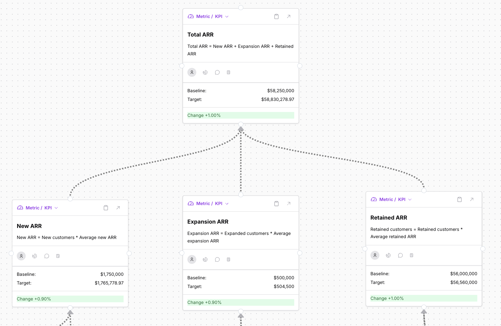
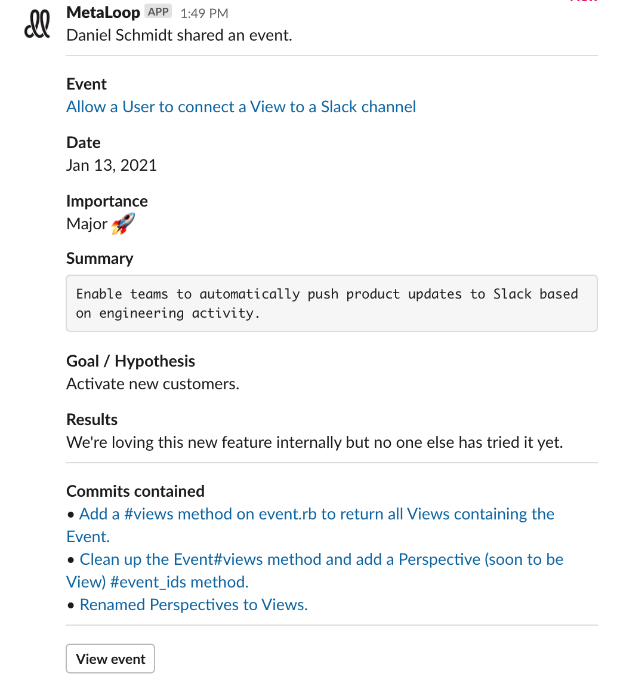

# Sending filtered notifications to Slack

DoubleLoop enables you to automatically communicate product changes via Slack. For example, you can use DoubleLoop to create real-time deployment notifications, curated launch announcements, and team-specific views. Check out this [demo video ](https://app.gitbook.com/@doubleloop/s/doubleloop/instructions/slack-setup)to see it in action. 

This page covers how to:

1. ⚙ Integrate DoubleLoop with Slack.
2. 🧤 Manually share DoubleLoop events in Slack.
3. 🤖 Automatically send product updates to Slack based on filtered "views" of your engineering activity.

If you haven't already created your DoubleLoop account or installed our GitHub app, go [here](https://doubleloop.gitbook.io/doubleloop/instructions/github-setup-instructions) first.

## ⚙ Integrate DoubleLoop with Slack

1. Login to your DoubleLoop account at [https://metaloop.app/](https://metaloop.app/)
2. Click the "settings" gear in the left nav.
3. Click on "Integrations."
4. Click "Install Slack app" and walk through the steps.
5. When you're done, you should see the Slack integration appear on the list.

## 🧤 Manually share DoubleLoop events in Slack

While the unique power of DoubleLoop is to _automatically_ push product updates to slack, you can also manually share events that are worth the attention of your team. And it's a good way to prove that your Slack integration is working.

1. From the [events page](https://metaloop.app/events) in DoubleLoop, click on the title of an event you want to share.
2. Click the "Share on Slack" button.
3. Select the channel or DM you want to send it to.
4. Click "Send to Slack".

A message like this will appear in your selected Slack channel:

## 🤖 Automatically send product updates to Slack

The power of DoubleLoop is unleashed when you design your own system for automatically pushing product updates to Slack based on filtered views of your engineering activity.

1. Start by creating a "view" that filters for the events you want to send to Slack. [From the events page](https://metaloop.app/events), use the filter options on the left until you see the relevant events. For example, you can search for only pull requests merged to your master branch.
2. When you're happy with your filters, click the "+" button to the right of VIEWS. Enter a name and click "Save View." Now you will see it in your list of views.
3. Click the icon to the right of the view to open a modal. In the modal, select a Slack channel or DM. \(Note: You might want to create a new Slack channel for the notifications. If so, you need to refresh the page to see the channel in the list.\)

Now, any new events that match the criteria for the view will be automatically sent to Slack! Create as many views as you want for any purpose. Teams have used DoubleLoop to create views for

* deployment notifications internal to the team,
* company-wide product announcements,
* the launches for each team.

## Give it a try!

We'd love your help improving DoubleLoop! Email us at **support@doubleloop.app** with any problems, ideas, or questions.

