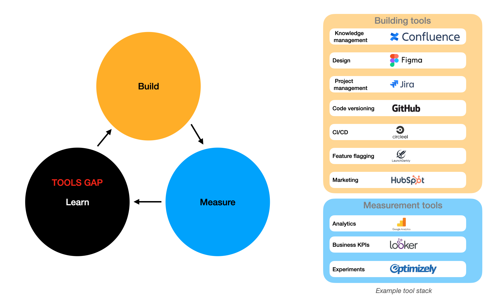
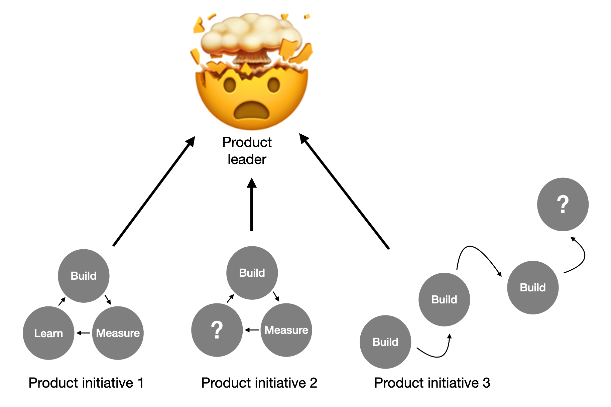
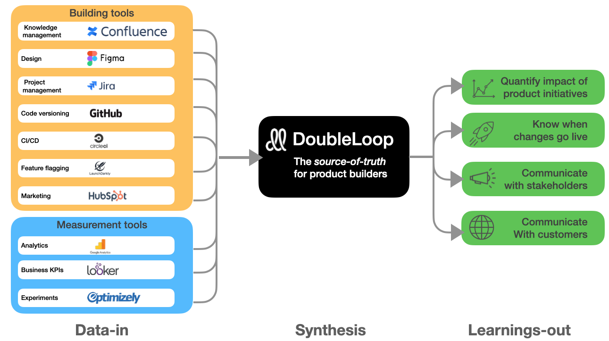

# The DoubleLoop vision \(2021\)

## Summary: DoubleLoop transforms how product leaders learn.

## The problem

Software companies struggle to run effective product initiatives.

* They waste money on initiatives that aren’t working
* They miss product-led growth opportunities.

It’s a learning problem.

### Today's tools create new learning opportunities and problems

The tools that product teams use to build and measure are becoming increasingly robust. Consequently, the _potential_ for teams to learn is massive.

However, as of now, there aren't any tools that

1. synthesize data from _across_ building and measurement tools
2. separate the signal from the noise.

Due to the tools gap, small teams accumulate tacit knowledge, but companies fail to learn at scale.

### Product leaders feel the pain

Unable to drink from the firehose of the building and measurement tools, product leaders...

* Lose command of what’s happening.
* Stifle innovation with micromanagement.
* Slow the team down with process.
* Fail to show their team’s impact.
* Lose stakeholder confidence.

## The solution: DoubleLoop is the only platform that synthesizes data from the building and measurement tools.

DoubleLoop ingests data from the building and measurement tools, makes connections, extracts the signal from the noise, and disseminates keys insights to the team.

DoubleLoop enables product leaders to understand the efficacy of their product initiatives so they can make the best bets moving forward. 

