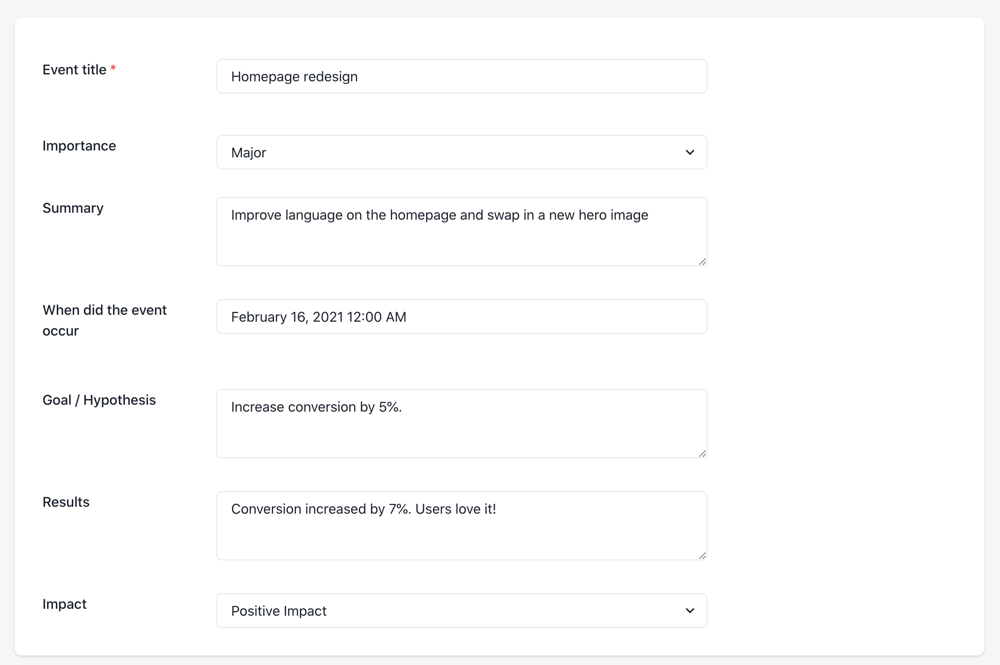

# A simple recipe that helps product teams improve

Learning requires humility. For a product management team to improve, PMs must be able to \(1\) look back at their previous assumptions and \(2\) change their thinking based on new information.  

Here's a simple recipe that will build your product team's learning muscles.

## **1. Record your product iterations**.

In all endeavors, record-keeping provides the foundation for continuous improvement. To get better at something, you need to know how you've performed in the past. For product managers, this means recording your previous product iterations. 

[DoubleLoop](https://www.doubleloop.app/) is designed to make recording product changes efficient. You could use a spreadsheet instead, but DoubleLoop makes it easier by automatically generating a list of your product changes via \(e.g.\) GitHub and Jira integrations.

## **2. Classify the "importance" of each product change.**

A good record of product iterations requires extracting the signal from the noise. Especially for teams that deploy frequently, you need to filter out the noise of engineering chores and bug fixes. At DoubleLoop, we classify each change as "Major," "Medium," or "Minor." Major changes have the potential for a large business impact. 

DoubleLoop helps by classifying the importance of product changes for you. For example, by default, DoubleLoop downgrades the importance of code changes made by bots, like library upgrades. 

## 3. For each important product change, write down the goal or hypothesis

Ideally, before you start building a product improvement, you've clearly articulated the goal or hypothesis of the change. Examples:

* "The goal of the homepage redesign is to increase the signup rate by 5%."
* "We're launching a new landing page to test if there is user demand for a new service we plan to offer."
* "By redesigning our search experience, we hypothesize that usability testing will show that users like it more than the current experience."

If you can boil down your goal or hypothesis to a time-bound key result, that's the best. But writing down almost anything is better than nothing. If you end up writing down your goal after launch, that's ok too.

## 4. After time passes, record the results of your important product changes.

Days, weeks, or months after a release, each PM should write down the "results" of their important changes. Results can either be quantitative or qualitative. Like with goals or hypotheses, writing down anything, even if unscientific, is far better than nothing. Examples:

* "The conversion rate increase by 7% after the change."
* "Our hypothesis was proven true/false."
* "We ran 6 usability tests after making the change. 5 out of 6 users said they preferred the new experience."
* "We shipped the new feature on time, but customers have been slow to adopt it."
* "The sales team loved it!"

The amount of time to wait after making a change depends on your product.

## 5. Hold a monthly "Results review" meeting

Here's the fun part where the team learns together. Schedule a monthly meeting and invite the whole product team. Prior to the meeting, everyone is expected to do the following:

**For every important product change that was released over a month ago, record the goal/hypothesis and result** in DoubleLoop \(or in whatever doc/spreadsheet you are using\).

In the meeting, go around the room. Each PM shares the goals and results of each of their iterations and the team provides feedback, thoughts, or suggestions.

The meeting has several benefits:

* Results review meetings create social pressure for PMs to "close the loop" on their previous product iterations. This is how PMs learn to make better bets.
* When looking back at a previous iteration, you might uncover that you can unlock 100% more value with 5% more work. Sometimes product launches barely miss the mark and can be easily iterated on to achieve success.
* Results review meetings create an environment of shared learning. PMs will benefit from learning about what's working and not working in areas of the product that they don't directly touch.

## "Results review" meetings are not "retrospectives"

You might be wondering if "Results review" is just another name for the more common "retrospectives" meetings. They are similar in that they both invite teams to look at the past to improve future performance. But their focus is different.

The focus of retrospective meetings is for a team to look at how they functioned together. Where was the ball dropped? Where were there workflow bottlenecks or frustrations?  

In a results review meeting, the focus is business outcomes. Are the product initiatives moving the needle or not?

Retrospectives help teams work better together. Results review meetings help PMs make better bets.

## We're happy to help!

We'd love to help you facilitate "Results review" meetings at your company. Feel Reach to reach out to support@doubleloop.app.

